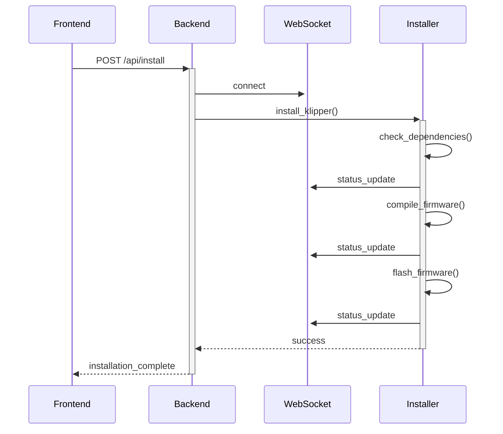

# Entwickler-Dokumentation

## 🏗️ Architektur

### Backend-Komponenten

#### 1. FastAPI Server (`main.py`)
- REST-API-Endpunkte
- WebSocket-Verbindungen
- CORS-Konfiguration
- Statische Dateien

#### 2. Installer (`installer.py`)
- Klipper-Installation
- Firmware-Kompilierung
- Board-Flashen
- Systemd-Service-Konfiguration

#### 3. Board-Detektor (`board_detector.py`)
- USB-Geräteerkennung
- Serielle Port-Erkennung
- DFU-Modus-Erkennung
- Board-Identifikation

#### 4. WebSocket-Manager (`websocket_manager.py`)
- Verbindungsverwaltung
- Status-Updates
- Fehlerbehandlung
- Logging

### Frontend-Komponenten

#### 1. Vue.js App (`App.vue`)
- Installationsschritte
- Board-Konfiguration
- WebSocket-Client
- Fortschrittsanzeige

#### 2. Komponenten
- `BoardSelector.vue`
- `ConfigEditor.vue`
- `InstallProgress.vue`
- `ErrorDisplay.vue`

## 🔄 Datenfluss

### Installation


## 🧪 Testing

### Backend-Tests

#### Unit-Tests
```bash
# Tests ausführen
pytest tests/

# Coverage-Report erstellen
pytest --cov=app tests/
```

Wichtige Test-Dateien:
- `test_installer.py`
- `test_board_detector.py`
- `test_websocket.py`

#### Integration-Tests
```bash
# Integration-Tests
pytest tests/integration/

# E2E-Tests
pytest tests/e2e/
```

### Frontend-Tests

#### Unit-Tests
```bash
# Tests ausführen
npm run test:unit

# Coverage-Report
npm run test:coverage
```

Test-Dateien:
- `App.spec.ts`
- `BoardSelector.spec.ts`
- `WebSocket.spec.ts`

#### E2E-Tests
```bash
# Cypress Tests
npm run test:e2e

# Mit UI
npm run test:e2e:open
```

## 📝 Code-Style

### Python
- Black für Formatierung
- Flake8 für Linting
- MyPy für Type-Checking

```bash
# Formatierung
black .

# Linting
flake8 .

# Type-Checking
mypy .
```

### TypeScript/Vue
- ESLint für Linting
- Prettier für Formatierung

```bash
# Linting
npm run lint

# Formatierung
npm run format
```

## 🔧 Development Setup

### 1. Backend
```bash
# Virtual Environment
python -m venv venv
source venv/bin/activate  # Windows: venv\Scripts\activate

# Dependencies
pip install -r requirements.txt
pip install -r requirements-dev.txt

# Development Server
uvicorn main:app --reload
```

### 2. Frontend
```bash
# Dependencies
npm install

# Development Server
npm run serve

# Production Build
npm run build
```

## 📦 Deployment

### 1. Docker
```bash
# Build
docker build -t innovateos-klipper .

# Run
docker run -p 8000:8000 innovateos-klipper
```

### 2. Manual
```bash
# Backend
gunicorn main:app -w 4 -k uvicorn.workers.UvicornWorker

# Frontend
nginx -c nginx.conf
```

## 🔒 Security

### 1. API Security
- Rate Limiting
- CORS-Konfiguration
- Input Validation

### 2. WebSocket Security
- Connection Limits
- Message Validation
- Heartbeat Checks

### 3. File Security
- Path Traversal Prevention
- File Type Validation
- Size Limits

## 📚 Dokumentation

### 1. API-Dokumentation
- OpenAPI/Swagger
- Endpoint-Beschreibungen
- Beispiel-Requests

### 2. Code-Dokumentation
- Docstrings (Python)
- JSDoc (TypeScript)
- Kommentare

## 🔍 Debugging

### 1. Backend
```python
# Logging aktivieren
logging.basicConfig(level=logging.DEBUG)

# Debugger
import pdb; pdb.set_trace()
```

### 2. Frontend
```javascript
// Vue DevTools
Vue.config.devtools = true

// Console Logging
console.log('Debug:', data)
```

## 🚀 Performance

### 1. Backend
- Async/Await
- Connection Pooling
- Caching

### 2. Frontend
- Lazy Loading
- Code Splitting
- Asset Optimization

## 📈 Monitoring

### 1. Logs
- Application Logs
- Access Logs
- Error Logs

### 2. Metrics
- Response Times
- Error Rates
- Resource Usage

## 🔄 CI/CD

### GitHub Actions
```yaml
name: CI/CD

on:
  push:
    branches: [ main ]
  pull_request:
    branches: [ main ]

jobs:
  test:
    runs-on: ubuntu-latest
    steps:
      - uses: actions/checkout@v2
      - name: Run Tests
        run: |
          pip install -r requirements.txt
          pytest

  deploy:
    needs: test
    runs-on: ubuntu-latest
    steps:
      - name: Deploy
        run: |
          # Deployment steps
```

## 📞 Support

### Community
- [GitHub Issues](https://github.com/Innovate3D-Labs/InnovateOS-Klipper-installer/issues)
- [Discord](https://discord.gg/Innovate3D-Labs)
- [Forum](https://forum.innovate3d-labs.com)

### Dokumentation
- [API Docs](https://docs.innovate3d-labs.com/api)
- [Development Guide](https://docs.innovate3d-labs.com/dev)
- [Contribution Guide](https://docs.innovate3d-labs.com/contribute)
